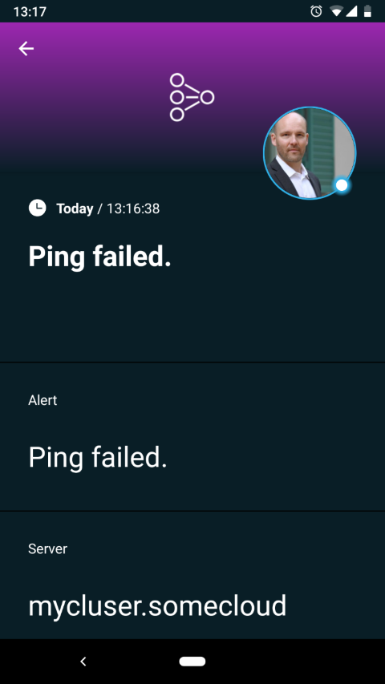
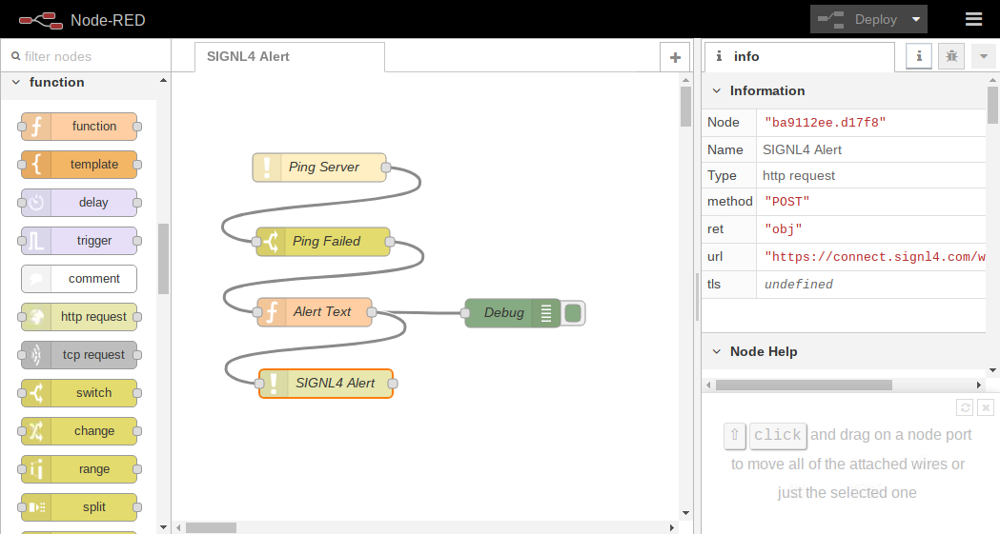

# Integrate SIGNL4 with Node-RED

Integrate SIGNL4 with Node-RED for mobile alerting via app, push, text, voice with tracking and escalation.

## Why SIGNL4
Node-RED is a flow-based development tool for visual programming for wiring together hardware devices, APIs and online services as part of IoT. Node-RED provides a web browser-based flow editor, which can be used to create JavaScript functions. It is shipped with some variants of Raspbian, the operating system of Raspberry Pi.
Integrating SIGNL4 with Node-RED can enhance your daily operations with an extension to your mobile team in the field or on the shop floor.

## How it Works
All it takes to pair Node-RED and SIGNL4 is an node that implements a webhook and encapsulates the SIGNL4 alerting capabilities.

Integration Capabilities
- Service engineers alerted via mobile push, text and voice
- Staff can acknowledge and take ownership for critical events that occur
- Alerts are escalated in case of no response
- Communicate within an alert to address a particular problem
- Alert on critical device states
- Two-way integration to interact or set the device state

Scenarios
- Industrial IoT
- Industry 4.0
- IoT Service Alerting
- IoT Device Management
- IT Operations
- Manufacturing, Utility, Oil and Gas, Agriculture, etc.

## Integrating SIGNL4 with Node-RED

Gathering events from IoT devices and sending team alerts in case of critical incidents is a broad field. It starts with simple prototypes using a Raspberry Pi and goes up to industrial IoT scenarios, machine data or distributed systems in the field and even IT operations.

SIGNL4 is a mobile alert notification app for powerful alerting, alert management and for mobile assignment of work items. Get the app at https://www.signl4.com.

Node-RED offers an easy-to-use and flexible workflow designer. The integration with SIGNL4 is straightforward. In the following we explain a simple IT monitoring case. We automatically ping a server in certain intervals and send an alert via SIGNL4 in case a ping fails.

### Prerequisites

A SIGNL4 (https://www.signl4.com) account
Node-RED (download at https://nodered.org or use it directly on your Raspberry Pi if available)

### Integration Steps

In Node-RED you can create a workflow as follows.

**Ping Server (ping)**
Specify the server you want to monitor (ping). For testing purposed you can specify a server that does not exist so the ping will fail.

**Ping Failed (switch)**
This switch checks if the ping failed. If so it will proceed to the next node.

**Alert Text (function)**
Assemble the SIGNL4 alert in JSON format.
We use the following script:
msg.payload = "{'Subjset': 'Ping failed.', 'Server': 'mycluser.somecloud'}";
return msg;

**Debug (debug)**
Just a helper to see the output in the debug view.

**SIGNL4 Alert (http request)**
This HTTP request will send the alert data to the SIGNL4 webhook. You need to specify your SIGNL4 webhook address including team secret here.

You can find the example code for importing at GitHub: https://github.com/signl4/signl4-integration-node-red in the file SIGNL4-Alert-Node-Red.txt.

### Test It

Now you can test your workflow by clicking Deploy. It will run immediately and if the ping fails you will receive the alert in your SIGNL4 app.
